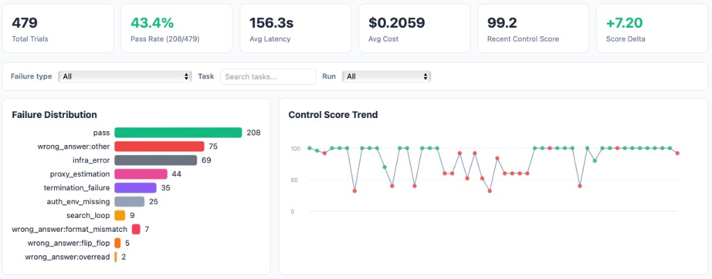
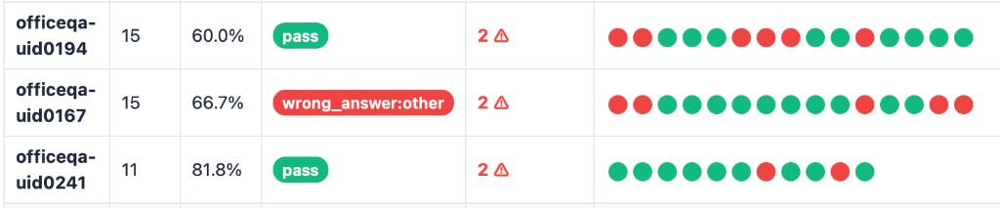
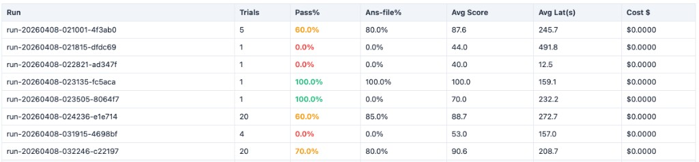
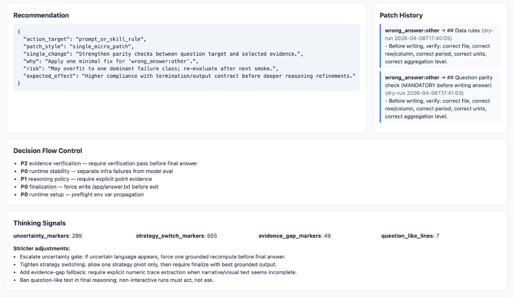

# Agent behavior control (demo kit)

**Turn agent benchmark runs into structured metrics, failure labels, and a tiny HTML report** — without standing up a server.

This repository exists to document an **evaluation loop** that worked well in practice: parse traces → classify failures → watch regressions → change one thing → rerun. It is intentionally **small and generic** so you can share the *ideas* and a **reference schema** publicly, while keeping a larger proprietary integration private.

## Why this exists

During an agent benchmark, raw scores hide *how* the agent failed (search loops, missing finalization, hedging language, oversized reads). This kit captures:

- A **trial record** schema (one row per task run) mixing verifier outcomes and trace-derived **behavior signals**  
- A **control score** heuristic that summarizes process quality (separate from correctness)  
- A **minimal CLI** that ingests JSONL and emits summary JSON + optional static HTML  

Use it for demos, blog posts, interviews, or as a starting point for your own analytics pipeline.

## What is included

| Path | Purpose |
|------|---------|
| [`docs/WORKFLOW.md`](docs/WORKFLOW.md) | End-to-end loop: run → ingest → classify → recommend → report |
| [`docs/DATA_MODEL.md`](docs/DATA_MODEL.md) | Every field on `TrialRecord` + failure taxonomy notes |
| [`docs/CASE_STUDY.md`](docs/CASE_STUDY.md) | High-level narrative (no proprietary code) |
| [`docs/SHARING.md`](docs/SHARING.md) | Licensing + how to grant permission for posts / reports |
| [`src/agent_behavior_control/`](src/agent_behavior_control/) | `TrialRecord`, `control_score`, summarize + HTML |
| [`examples/sample_trial_records.jsonl`](examples/sample_trial_records.jsonl) | Fully synthetic data |

## Local results (one real tuning window)

Numbers below come from a **single export** of the internal dashboard (hundreds of trials on a document-QA agent). They are **not** the public minimal HTML in this repo; they illustrate what you can build once you emit `TrialRecord` JSONL from your harness.

| Metric | Value | Notes |
|--------|------:|--------|
| **Trials in view** | 479 | All tasks × reruns in the analysis window |
| **Pass rate (aggregate)** | **43.4%** (208 / 479) | Mix of easy and hard tasks; includes infra/auth failures |
| **Avg cost / trial** | **~$0.21** | OpenRouter-style pricing on chat agent (input-heavy) |
| **Avg latency** | **~156 s** | Wall-clock agent execution |
| **Best 20-task sample** | **85%** (17 / 20) | Fixed local smoke set after iterative prompt + per-task instruction edits |
| **Path to ~85% sample** | **~400+ trial rows** logged | Many per-task reruns and batch runs—not one shot of 20 tasks |

The **85%** figure is **sample accuracy** on ~20 held tasks, not the full ~246-task server set. Aggregate **43%** reflects the whole history (including noisy runs). Use the tracker to separate **infra** from **model** and to spot **per-task regressions** when you change prompts.

## Screenshots (internal dashboard)

These panels are from a **full static HTML report** generated from the same kind of data as [`docs/DATA_MODEL.md`](docs/DATA_MODEL.md): failure counts, recommendations, per-task timelines, and run-level rollups.

### Overview — KPIs, filters, failure mix, control-score trend



Top cards summarize volume and cost; bars show **failure taxonomy** (pass, wrong-answer subtypes, infra, etc.); the chart is **control score** over recent trials (green = pass, red = fail).

### Task history — pass rate per task and attempt timeline



Each row is one **benchmark task**. Dots are **chronological trials** (green = pass, red = fail). Useful for seeing **flaky** tasks and **regressions** after a prompt change.

### Run-level timeline — batch runs compared



Each row is one **harness run** (e.g. a `--all` or batch). Compare pass rate, answer-file compliance, and cost across runs.

### Recommendation, patch history, decision flow, thinking signals



**Recommendation**: structured “one change” hint. **Patch history**: dry-runs vs applied edits. **Decision flow**: priority-ordered controls. **Thinking signals**: aggregated uncertainty / pivot language to suggest stricter rules.

### Images in GitHub READMEs

- There is **no separate “image upload” API** for READMEs: you **commit image files** in the repo (e.g. under `docs/images/`) and link them with ``.
- **Practical limits**: very large PNGs slow the page. Stay roughly **under ~1–2 MB per image** when possible (these four are ~40–100 KB each). GitHub blocks files **≥ 100 MB**; repos should stay well below **~1 GB** total for a smooth experience.

## What is *not* included (by design)

- No vendor-specific harness code, corpus paths, or private “auto-patch” runners  
- No trace parser for a particular agent stack — you implement `trial_dir → dict` for your logs  

That separation lets you **open-source the methodology** while keeping startup- or client-specific automation private.

## Quick start

From this directory, no install needed (stdlib only):

```bash
PYTHONPATH=src python3 -m agent_behavior_control.cli \
  examples/sample_trial_records.jsonl --html /tmp/behavior_demo.html
```

That prints a short JSON summary and writes a small HTML report. Use any JSONL whose objects match [`docs/DATA_MODEL.md`](docs/DATA_MODEL.md); swap the path for your own file.

Optional: `pip install -e .` then run `abc-demo …` if you prefer a short command name (see `pyproject.toml`).

## Design notes for interviews

- **Cost vs latency**: In chat-style agents, *input tokens* often grow with retrieval depth because prior tool outputs stay in context. Tracking `retrieval_actions` alongside `n_input_tokens` makes that visible.  
- **Regressions**: Group rows by `task_name` and detect pass → fail transitions across runs to catch prompt changes that break single tasks.  
- **One change at a time**: The loop works best when recommendations stay minimal; multi-edit prompts are hard to attribute.  

## GitHub repository

Public home: **[github.com/paulinastern/lakmus-demo](https://github.com/paulinastern/lakmus-demo)**


## License

MIT — see [`LICENSE`](LICENSE).

## Author

Paulina Stern — kit extracted for public sharing; production integrations may differ.
